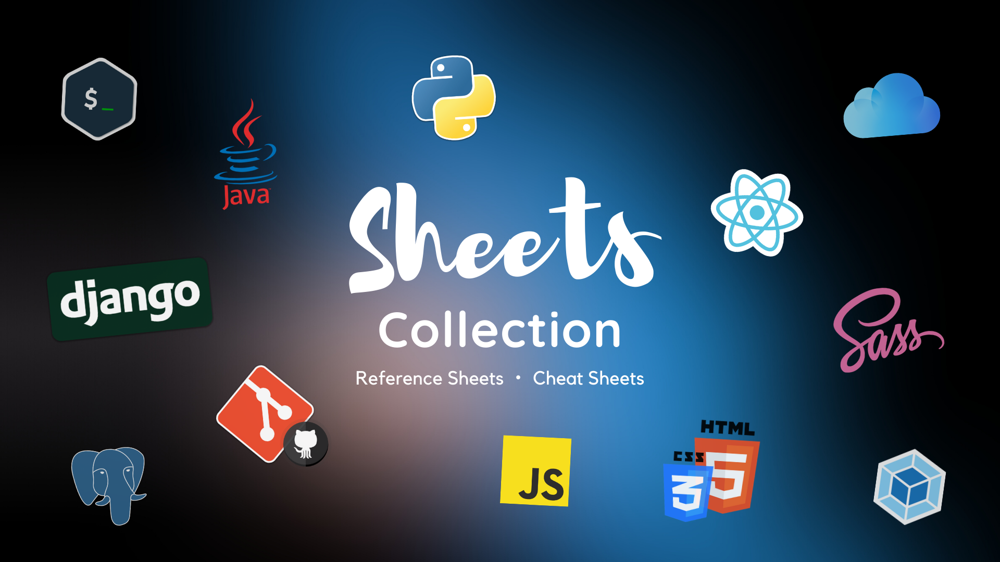

# Sheets Collection

> ### A Place to find cheat sheets of different programming technologies

**Cheat Sheets -** Contains the daily use **codes**, **properties** and **shortcuts**.

**Reference Sheets -** Contains Study material such as **roadmaps** and **websites.**

**Concept Sheets** - Contains the **explanation of specific details** about the working.

- It is recommended to download this repo and preview in a markdown software [Ex. Obsidian] for best experience. 
- Or You can visit my [Dev.to Blog](https://dev.to/zinox9) To Preview them Online

----

### Languages

- [**HTML, CSS & Responsiveness**](./languages/htmlcss.md)  `Reference & Cheat Sheet`
- [**Javascript Roadmap**](./languages/js.md) `Reference Sheet`
- [**Javascript Behind The Scenes**](./languages/jsBehind.md) `Concept Sheet`

----

### Frameworks/Libraries

- [**Sass & Tools with Boilerplate**](./framlib/sass.md) `Reference & Cheat Sheet`
- [React Cheatsheet](./framlib/react.md) `Concept & Cheat Sheet`

---

### Tools

- **[Git & Github](./tools/git.md)** `Cheat Sheet`
- [**Command Line & Vim, Nano**](./tools/terminal.md) `Cheat Sheet`
- [**Webpack**](./tools/webpack.md) `Cheat Sheet`