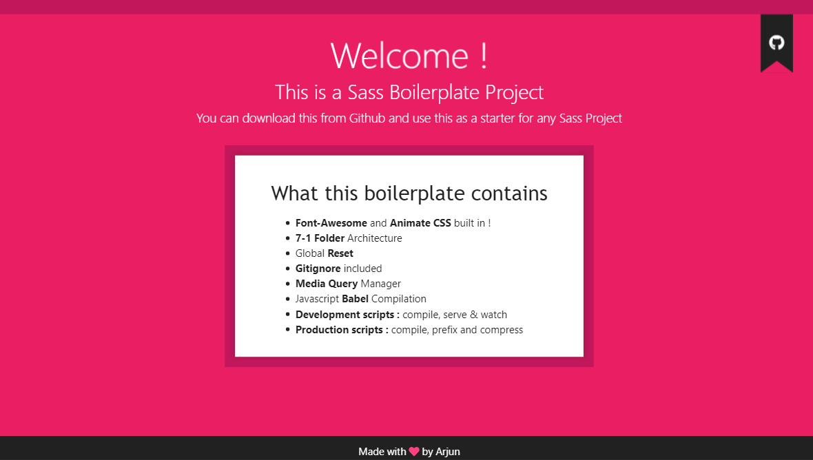

#### Table of Contents

[**Sass & Tools with Boilerplate**](#sass--tools-with-boilerplate)

- **[Sass](#sass)**
- **[BEM](#bem)**
- [**7-1 Folder Architecture**](#7-1-folder-architecture)
- [**NPM Setup Boilerplate**](#npm-setup-boilerplate)

---

# Sass & Tools with Boilerplate

> **This sheet contains references to use Sass, BEM & 7-1 folder Architecture and Boilerplate to get started easily with a Sass project.**

---

# Sass

- **Variables** for reusable values : [Usage](https://marksheet.io/sass-variables.html)
  `$pink: #ff1493;`

- **Nesting** to nest Selectors inside of one another for less code : [Usage](https://marksheet.io/sass-nesting.html)
  
  ```scss
  //scss
  .parent{
    .child{}
  }
  
  // becomes in css
  .parent .child{}
  ```

- **Operators** for mathematical operations in CSS : [Usage](https://www.sitepoint.com/sass-basics-operators/)
  `font-size: (16px / 24px) // Uses parentheses, does division`

- **Partials and Imports** (@rules) write code in different files and merge them : [Usage](https://www.sitepoint.com/sass-basics-rules-directives/)
  `@import "sample";`

- **Mixins** write reusable piece of code : [Usage](https://www.sitepoint.com/sass-basics-the-mixin-directive/)
  
  ```scss
  @mixin overlay() {
    bottom: 0;
    left: 0;
    position: absolute;
    right: 0;
    top: 0;
  }
  
  .modal-background{
    @include overlay();
    background: black;
    opacity: 0.9;
  }
  ```
  
  - Mixins & Placeholders : [comparison](https://www.sitepoint.com/sass-mixin-placeholder/) 

- **Functions** are similar to mixins but produce a value : [Usage](https://www.sitepoint.com/sass-basics-function-directive/)
  
  ```scss
  @function remy($pxsize) {
      @return ($pxsize/16)+rem;
  }
  
  h1 { font-size: remy(32);}
  ```

- **Extends** to inherit same declaration in  different selectors : [Usage](https://marksheet.io/sass-extend.html)
  
  ```scss
  // scss
  .small-uppercase{
    color: lightslategrey;
    font-size: 10px;
  }
  
  .modal-background{
    @extend .small-uppercase;
  }
  
  // generated css
  .small-uppercase,
  .modal-background{
    color: lightslategrey;
    font-size: 10px;
  }
  ```

- **Control Directives** to write complex code using conditionals and loops (, @content, @if) : [Usage](https://www.sitepoint.com/sass-basics-control-directives-expressions/)
  
  ```scss
  @mixin test($condition) {
      $color: if($condition, blue, red);
      color:$color
  }
  ```

---

# BEM

- BEM — Block Element Modifier is a methodology that helps you to create reusable components and code sharing in front-end development

- Example : 
  
  ```html
  <form class="form form--theme-xmas">
    <input
      class="form__submit form__submit--disabled"
      type="submit" />
  </form>
  ```
  
  ```scss
  .form { } //block
  .form--theme-xmas { } //block--modifier
  .form__submit { } //block__element
  .form__submit--disabled { } //block__element--modifier
  ```

- **BEM by Example :** [Reference](https://seesparkbox.com/foundry/bem_by_example)

- **ABEM -** A better approach to use BEM , [Explanation](https://css-tricks.com/abem-useful-adaptation-bem/)
  
  ```css
  /* classic + atomic prefix */
  .o-subscribe-form__field-item {}
  
  /* camelCase + atomic prefix */
  .o-subscribeForm__fieldItem {}
  ```

---

# 7-1 Folder Architecture

- **Folder Structure in Practice :** [Reference](https://www.sitepoint.com/architecture-sass-project/)

- The 7–1 pattern is a common Sass architecture, and is recommended by the [Sass Guidelines Project](https://sass-guidelin.es/#architecture). Here’s the basic structure:
  
  ```
  sass/
  |
  |– abstracts/             # HELPER FILES
  |   |– _variables.scss    # Sass Variables
  |   |– _mixins.scss       # Sass Mixins
  |
  |– vendors/               # THIRD-PARTY FILES
  |   |– _bootstrap.scss    # Bootstrap
  |
  |– base/                  # BOILERPLATE FILES
  |   |– _reset.scss        # Reset/normalize
  |   |– _typography.scss   # Typography rules
  |
  |– layout/                # STRUCTURE FILES
  |   |– _navigation.scss   # Navigation
  |   |– _grid.scss         # Grid system
  |   |– _header.scss       # Header
  |   |– _footer.scss       # Footer
  |   |– _sidebar.scss      # Sidebar
  |   |– _forms.scss        # Forms
  |
  |– components/            # SPECIFIC COMPONENTS FILES
  |   |– _buttons.scss      # Buttons
  |   |– _carousel.scss     # Carousel
  |   |– _cover.scss        # Cover
  |   |– _dropdown.scss     # Dropdown
  |
  |– pages/                 # PAGE SPECIFIC FILES
  |   |– _home.scss         # Home specific styles
  |   |– _contact.scss      # Contact specific styles
  |
  |– themes/                # MULTIPLE THEME FILES
  |   |– _theme.scss        # Default theme
  |   |– _admin.scss        # Admin theme
  |
   – main.scss              # Main Sass input file
  ```

---

## NPM Setup Boilerplate

- I have made a complete NPM setup for sass development , that you can use as a boilerplate for your project
- It contains :
  - **Font-Awesome** and **Animate CSS** is built in !
  - **7-1 Folder** Architecture
  - Global **Reset**
  - **Gitignore** Included
  - **Media Query** Manager
  - JavaScript **Babel** Compilation 
  - **Development scripts** : compile, serve and watch
  - **Production scripts** : compile, prefix and compress.
- **You can Find this Boilerplate in my [Github Repo](https://www.github.com/zinox9/sassplate)**



---

Hope This Helps , Thank You !😊