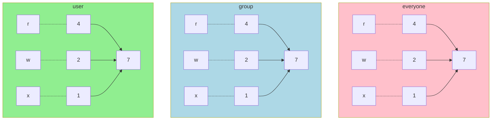

#### Table of Contents

[**Command Line Cheat Sheet**](#command-line-cheat-sheet)

- **[Navigating and Finding Files](#navigating-and-finding-files)**
  - [Listing Files & directory](#listing-files--directory)
  - [Changing directory](#changing-directory)
  - [Finding Files](#finding-files)
- **[Shortcuts](#shortcuts)**
- [**Creating Files & Directories**](#creating-files--directories)
  - [Copying and Moving/Renaming Files](#copying-and-movingrenaming-files)
  - [Removing Files](#removing-files)
  - [Reading and Writing files](#reading-and-writing-files)
- **[MAN (Manual Pager) & Help](#man-manual-pager--help)**
- [**Extras**](#extras)
  - [Piping](#piping)
  - [File Permissions](#file-permissions)
- [**Command Line Tools**](#command-line-tools)
  - [LESS Viewer](#less-viewer)
  - [Nano Editor](#nano-editor)
  - [Vim editor](vim-editor)

# Command Line Cheat Sheet

> This Sheet Contains all the basic command prompt commands, from moving and editing files to shortcuts for using the command line, This sheet also has commands list of Command Line editors.

---

## Navigating and Finding Files

- `pwd` = Tells the current working directory

### Listing Files & directory

- `ls` = list all files in the current directory 

- `ls -a` & `ls -la` = list files with extra info

- `ls ./documents ` = lists all the files of the relative path [`./` is not necessary]

### Changing directory

- ``cd folder/sub_folder`` = can be used to go change current directory

- ``cd ..`` OR ``cd ../..`` = used to go up directories

- `cd` = moves to home directory

- `` D:``= to change drive working on [for DOS/Windows]

- `pushd PATH`= changes to specified path and saves the current path

- `popd` = brings back to the saved path of `pushd`

### Finding Files

- `locate FILE_NAME` = finds all the directories where the file is

---

## Shortcuts

- `ctrl+r` : search all commands

- `ctrl+a` : cursor to beginning

- `ctrl+e` : cursor to end

- `ctrl+l` OR `clear` : clear screen

- `ctrl+c` : to stop a command that keeps running

- `killall firefox` : kills a process

- `ctrl+d` OR `exit` : exit the prompt

---

## Creating Files & Directories

- ``touch file_1.txt file_2.txt`` = creates empty files
- ``echo "hello textfile" > file_2.txt`` = adds text and creates file
- ``echo "hello again" >> file_2.txt`` = adds text to already created file
- ``mkdir folder_name folder_name_2``  = can create folder with these
- ``mkdir -p folder/sub_folder`` = used to create directories

### Copying and Moving/Renaming Files

- `cp from_dir/file to_dir/file`  = copies files , works with files in the current directory if no dir specified
- `mv old_file_name new_file_name` = move command , when used in the same directory , deletes the old file and makes a new file with the new_file_name (Renaming)
- `mv from_dir/file to_dir/file` = here move command copies the from file and deletes it , pastes it in to dir

### Removing Files

- `rm file_name` = the file will be deleted 
- `rm *` = remove all files in directory
- `rm file*` = removes all the files in the directory starting with 'file'
- `rm -r` = this removes the directory (-r mean recursively ,i.e remove all files all subdirectory and the directory itself)
- `rmdir DIR` = removes directories that don't have anything in them

### Reading and Writing files

- `cat file_name` = reads the file and prints it in terminal
- `cat > file_name` = creates a new file and saves the input text (ctrl+d to exit)
- `cat >> file_name` =  takes input of text to store and add it to file 
- `cat file1 file2` = prints contents of both files
- `more file1` = shows the huge text of file in steps , can exit anytime pressing q

---

## MAN (Manual Pager) & Help

- `man` brings all information about specific command on terminal
- Example : ``man bash`` , ``man git``
- `whatis COMMAND` =  lets us know what the command does (executables)
- `help COMMAND` = information of shell comands (ex. cd)

---

## Extras

- `which command_name` = checks  if the command is there and where it is

- `history` = lists all the commands typed in

- `watch free -h ` = watch , keeps on running a command every 2 seconds and free lists the space available in pc

### Piping

- `history | less` = opens history in less mode
- `ls -al / > lsout.txt` = redirecting output of ls into a file

### File Permissions

- output of `ls -l` shows file permissions and users with file info
- Groups  - USER , GROUP , EVERYONE
- Permissions - r = read (4 bit) , w = write(2 bit) , x = execute(1 bit) , all = 8 bit
- adding the values will produce appropriate number for rights given

- `chmod 700 file1` - makes the file read write exec only for user
- `chmod 744 file1` - makes the file rwx for user , and read for others
- `chmod 644 file1` - user can rw and others only read 
- `chmod 755 file1` - user can rwx and others can rx
- `chmod 755 dir` - mostly used for directories , rwx[USER] | rx[Group] | rx[Every]

---

## Command Line Tools

### LESS Viewer

- `less file1` = opens the specific file

| Commands                           | Action                                       |
| ---------------------------------- | -------------------------------------------- |
| `Down arrow`, `Enter`, `e`, or `j` | Move forward one line.                       |
| `Up arrow`,`y` or `k`              | Move backward one line.                      |
| `Space bar` or `f`                 | Move Forward one page.                       |
| `b`                                | Move Backward one page.                      |
| `/pattern`                         | Search forward for matching patterns.        |
| `?pattern`                         | Search backward for matching patterns.       |
| `n`                                | Repeat previous search.                      |
| `N`                                | Repeat previous search in reverse direction. |
| `g`                                | Go to the first line in the file.            |
| `Ng`                               | Go to the N-th line in the file.             |
| `G`                                | Go to the last line in the file.             |
| `p`                                | Go to the beginning of the file.             |
| `Np`                               | Go to N percent into file.                   |
| `v`                                | Open file in your Preferred CMD editor.      |
| `h`                                | Display help.                                |
| `q`                                | Exit `less`.                                 |

---

### Nano Editor

- `nano` = create new file & open editor

- `nano file1.php` = open a specific file using nano

- **Ctrl** is represented as `^` 

- **Alt** is represented as `M`

| **Commands**     | Actions                 |
| ---------------- | ----------------------- |
| Ctrl + O  , `^O` | Save A File             |
| Alt + B , `M-B`  | Create a Backup         |
| ^X               | Exit file , with prompt |
| M-U              | Undo an action          |
| ^G               | Get Help                |

| **Commands** | Navigate Actions            |
| ------------ | --------------------------- |
| ^F           | Move one character forward  |
| ^B           | Move one character backward |
| ^Space       | Move one word forward       |
| M-Space      | Move one work backward      |
| ^P           | Move to previous line       |
| ^N           | Move to next line           |
| ^V           | Move to next page           |
| ^Y           | Move to previous page       |
| ^A           | Move to Beginning of line   |
| ^E           | Move to End of line         |

| **Commands** | Search Actions        |
| ------------ | --------------------- |
| ^W           | To open Search prompt |
| ^T           | To Search Line Number |
| M-W          | Go to Next result     |
| ^R           | Replace Searched Text |

| **Commands** | Text Actions      |
| ------------ | ----------------- |
| M-6          | Cut Text / Line   |
| ^K           | Copy Text / Line  |
| ^U           | Paste Copied Data |

---

### Vim editor

- Changing mode from one to another

- From command mode to insert mode **type `a/A/i/I/o/O`** ( see details below)

- From insert mode to command mode **type** `Esc` (escape key)

#### Text Entry Commands (Used to start text entry)

- **a** =Append text following current cursor position

- **A** = Append text to the end of current line

- **i** = Insert text before the current cursor position

- **I** = Insert text at the beginning of the cursor line

- **o**  = Open up a new line following the current line and add text there

- **O**  = Open up a new line in front of the current line and add text there

#### Cursor Movement Commands

- **h** = Moves the cursor one character to the left

- **l** = Moves the cursor one character to the right

- **k** = Moves the cursor up one line

- **j** = Moves the cursor down one line

- **nG or :n** = Cursor goes to the specified (n) line (ex. 10G goes to line 10)

- **^F (CTRl F)** = Forward screenful

- **^B** = Backward screenful

- **^f** = One page forward

- **^b** = One page backward

- **^U** = Up half screenful

- **^D** = Down half screenful

- **$** = Move cursor to the end of current line

- **0 (zero)** = Move cursor to the beginning of current line

- **w** = Forward one word

- **b** = Backward one word

#### Exit Commands

- **:wq** = Write file to disk and quit the editor

- **:q!** = Quit (no warning)

- **:q** = Quit (a warning is printed if a modified file has not been saved)

- **ZZ** = Save workspace and quit the editor (same as :wq)

#### Text Deletion Commands

- **x** = Delete character

- **dw** = Delete word from cursor on

- **db** = Delete word backward

- **dd** = Delete line

- **d$** = Delete to end of line

- **d^ (d caret, not CTRL d)** = Delete to beginning of line

#### Yank (has most of the options of delete) -- VI's copy command

- **yy** = yank current line

- **y$** = yank to end of current line from cursor

- **yw** = yank from cursor to end of current word

#### Paste (used after delete or yank to recover lines.)

- **p** =  paste below cursor
- **P** = paste above cursor

#### Undo & Restore

- **u** = Undo last change

- **U**  = Restore line

- **J**  = Join next line down to the end of the current line

#### File Manipulation Commands

- **:w** = Write workspace to original file

- **:W** = file Write workspace to named file

- **:e**  = file Start editing a new file

- **:r** = file Read contents of a file to the workspace

#### Pages

To create a page break, while in the insert mode, press the **CTRL key**

And **l**.  **^L** will appear in your text and will cause the printer to start

A new page.

---
